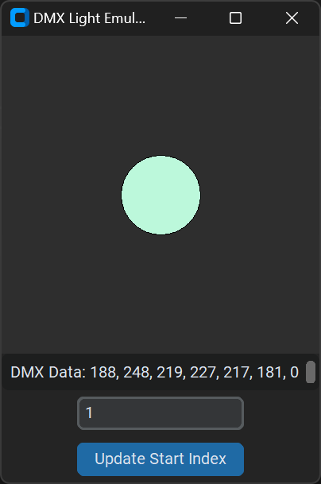

# Simple DMX Visualizer

A simple program that visualizes RGB DMX / ArtNet data. This tool is designed for a single light fixture with 3 channels (RGB).



## Features

- **Visual Representation**: Displays DMX data as a colored light on a canvas.
- **DMX Data Display**: Shows DMX data in decimal format in a text box.
- **Configurable Start Index**: Allows the user to set the starting index for DMX data.

## Download
Feel free to download a copy of the executable from the releases page: https://github.com/fredeerock/simpleDmxVisualizer/releases. 

## Usage

1. The DMX Visualizer window will open, displaying a black oval representing the light.

2. Send DMX data to the visualizer on port 6454. The oval will change color based on the received RGB values.

3. The DMX data will be displayed in decimal format in the text box below the canvas, excluding the first 17 values.

4. Adjust the starting index for the DMX data using the entry box and update button.

## Running from Source

### Requirements

- Python 3.x
- `customtkinter` library
- Standard libraries: `socket`, `struct`, `threading`

### Installation

1. Clone the repository:
    ```sh
    git clone https://github.com/yourusername/dmx-visualizer.git
    cd dmx-visualizer
    ```

2. Install the required libraries:
    ```sh
    pip install customtkinter
    ```

3. Run the `main.py` script:
    ```sh
    python main.py
    ```